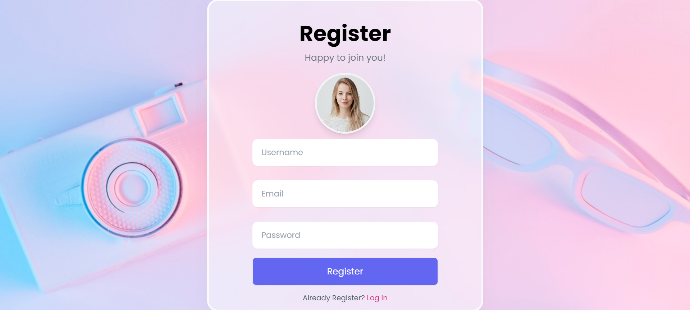
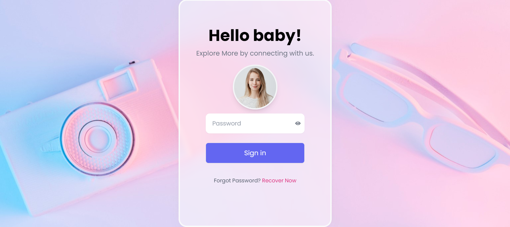
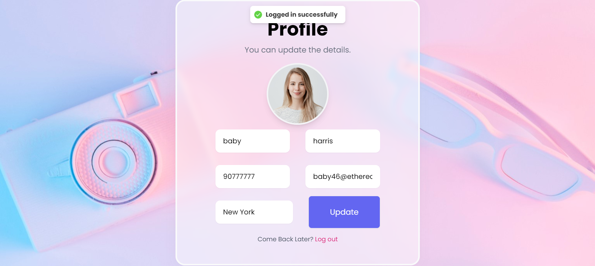
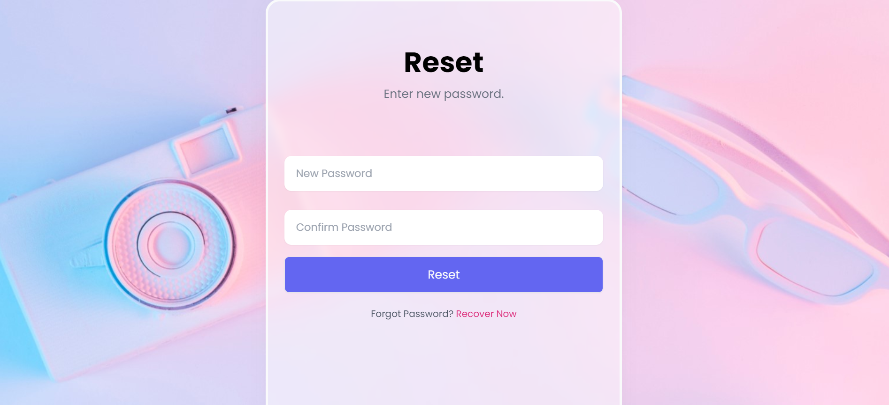
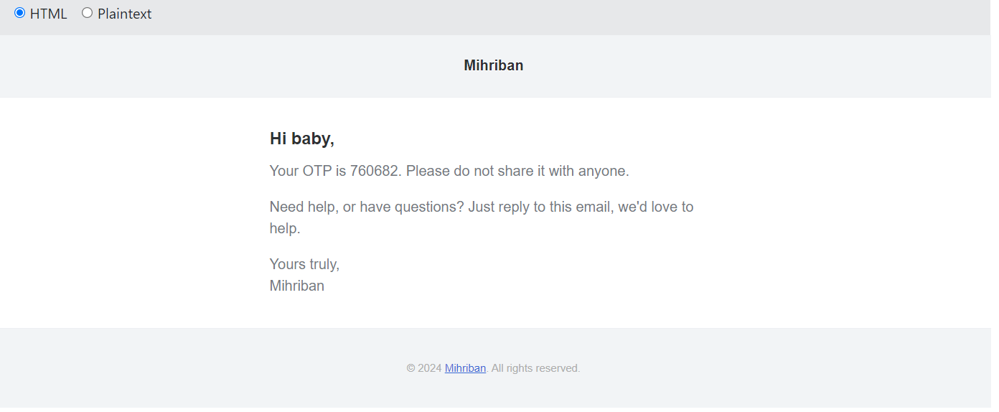

# Full Stack Login App

The Login App is a user authentication application that enables users to register, log in, update their profiles, reset their passwords via email, and upload profile pictures. It is built using the MERN stack, providing a seamless experience for user management.

## Overview

This app allows users to create an account, log in, and manage their profile settings. It includes features for updating personal information and resetting passwords through an OTP sent to their email. The goal is to provide a secure and user-friendly interface for managing user accounts.

## Features

- User registration and login
- Profile updates (including profile picture upload)
- Password reset via email with OTP verification
- Responsive design for various devices
- Optimized performance with state management

## Technologies Used

### Frontend

- **React**: Frontend library for building the user interface
- **React Router**: For client-side routing
- **Formik**: Form management and validation
- **Axios**: For making HTTP requests
- **Tailwind CSS**: Utility-first CSS framework for styling
- **Zustand**: State management
- **React Hot Toast**: Notifications for user actions

### Backend

- **Node.js**: JavaScript runtime environment for the backend
- **Express.js**: Web framework for building APIs
- **MongoDB & Mongoose**: NoSQL database and object data modeling (ODM)
- **JWT**: Authentication using JSON Web Tokens
- **Nodemailer**: For sending emails (e.g., OTP for password reset)
- **Bcrypt**: For hashing passwords
- **Mailgen**: For generating email templates
- **OTP Generator**: For creating one-time passwords

## Screenshots

